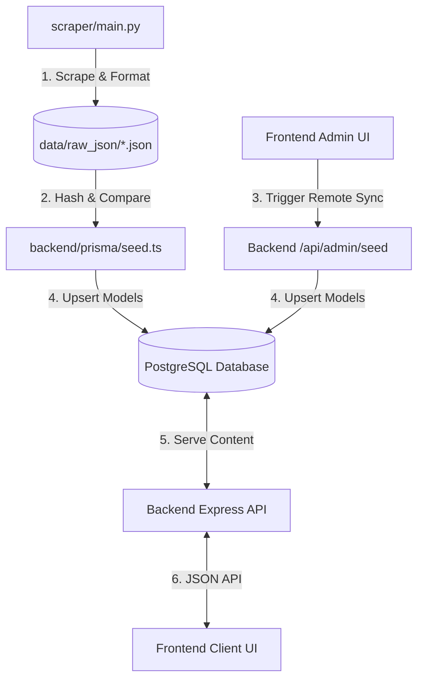

# ShahLMS

Welcome to **ShahLMS**, a premium, open-source, and feature-rich learning management system and coding sandbox designed for hosting and practicing programming challenges. It features an interactive coding arena, database seeding pipelines, progress tracking, and administrative governance capabilities. Because the platform is completely data-agnostic, anyone can deploy it and seed it with their own custom problem sets.

---

## 🚀 Overview

ShahLMS provides a seamless, LeetCode-like user experience. It allows users to browse problems, write code inside an interactive Monaco Editor, run simulated tests, view editor boilerplate templates, check detailed editorials, and track their stats (streaks, stars, trophies).

The application operates as a decoupled client-server project, including a native desktop wrapper:
1. **Frontend**: React 19 single-page app bundled with Vite, styled with TailwindCSS, using Framer Motion for premium micro-animations.
2. **Backend**: Express API server written in TypeScript, using Prisma ORM to communicate with a PostgreSQL database.
3. **Desktop App (Tauri)**: A native desktop wrapper for macOS and Windows built with Tauri v2 and Rust, featuring secure loopback Google OAuth, a background auto-updater, and a local parallel code runner.
4. **Scraper Pipeline**: An integrated Python-based scraping tool (located in the workspace root at `scraper/` and managed by `main.py`) which crawls course syllabus/practice questions and feeds clean, standardized JSON problems directly to the seeding pipeline. Note that the platform is generic and can ingest any problem data matching the schema.

---

## 📐 System Architecture & Data Pipeline

The platform is designed to ingest data dynamically from scraped sources:



* For a deep-dive into component layouts and data flows, check the [System Architecture Guide](file:///Users/shahnawaz/Desktop/Projects/Playground/AZ_Exploration/platform/docs/architecture.md).

---

## 🛠️ Tech Stack & Key Libraries

### Frontend (`/platform/frontend`)
* **React 19** & **TypeScript** with **Vite** for rapid hot-reloading development.
* **TailwindCSS** for responsive UI and layout.
* **Framer Motion** for premium interactive animations.
* **Monaco Editor (`@monaco-editor/react`)** powering the interactive coding sandbox.
* **KaTeX** & **React Markdown** for mathematical equations and Markdown problem descriptions.
* **React Router v7** for Client-side routing & protected routes.

### Backend (`/platform/backend`)
* **Node.js** & **Express** written in strictly-typed **TypeScript**.
* **Prisma ORM** mapping Postgres database models.
* **JWT (JSON Web Tokens)** for secure, session-based authentication.
* **Google Auth Library** facilitating Google OAuth2 sign-in.

### Desktop App (`/platform/desktop`)
* **Tauri v2** & **Rust** (handling secure file system isolation, compiler processes, and command binding).
* **Local Compiler Engine**: Detects system compilers, executes code binaries, and manages process execution timeout supervisors.
* **In-app Update Agent**: Validates public key cryptography (`tauri-plugin-updater`) and automates patching and relaunching.

---

## 📂 Project Structure

```
platform/
├── backend/               # Node.js/TypeScript Express Server
│   ├── prisma/            # Database schema & sync-seeding logic
│   │   ├── schema.prisma  # Database models definition
│   │   └── seed.ts        # Script to sync data from raw JSONs
│   └── src/
│       ├── config/        # Database connectivity setup
│       ├── features/      # Modular backend features (auth, problems, admin)
│       └── middlewares/   # Auth, admin guard gates, and error handlers
├── frontend/              # React 19 Client SPA
│   ├── src/
│   │   ├── components/    # Common layouts, sidebars, mathematical renderers
│   │   ├── lib/           # Centralized Fetch API client
│   │   └── pages/         # Dashboard, login, problems, admin seeding panels
│   └── vercel.json        # Production client settings
├── desktop/               # Tauri macOS & Windows Desktop Wrapper
│   ├── src-tauri/         # Rust backend (compiler runner & configurations)
│   └── src/               # React frontend (Monaco workspace and runner settings)
├── docs/                  # Detailed engineering manuals
│   ├── mock_tracker.md    # Frontend-mocked features roadmap
│   ├── architecture.md    # Component structure & security design
│   ├── api_spec.md        # API endpoints and payloads specifications
│   ├── database.md        # PostgreSQL database design mapping
│   └── setup_guide.md     # Detailed installation & configuration instructions
└── vercel.json            # Monorepo monobuild configuration
```

---

## 🏁 Quick Start (Development)

Ensure you have **Node.js (v18+)** and **PostgreSQL** running on your system.

### 1. Database Setup
1. Inside the PostgreSQL server, create a database named `shahlms`.
2. Configure `.env` in `platform/backend/.env`:
   ```env
   DATABASE_URL="postgresql://<user>:<password>@localhost:5432/shahlms?schema=public"
   JWT_SECRET="your_jwt_secret"
   GOOGLE_CLIENT_ID="your_google_client_id"
   PORT=5001
   ```

### 2. Install & Run Backend
```bash
cd platform/backend
npm install
npm run build          # Generates Prisma client & compiles TypeScript
npm run prisma:push    # Pushes schema to Postgres database
npm run db:seed        # Seeds problem catalogs from data/raw_json/ files
npm run dev            # Starts Nodemon watcher at http://localhost:5001
```

### 3. Install & Run Frontend
```bash
cd platform/frontend
npm install
npm run dev            # Runs Vite Server at http://localhost:5173
```

*For troubleshooting and detailed environment setup instructions, refer to the [Developer Setup Guide](file:///Users/shahnawaz/Desktop/Projects/Playground/AZ_Exploration/platform/docs/setup_guide.md).*

---

## 📖 Deep Dive Documentation Links

Please consult our detailed sub-manuals for additional operational insight:

* 🗺️ **[System Architecture Guide](file:///Users/shahnawaz/Desktop/Projects/Playground/AZ_Exploration/platform/docs/architecture.md)** — Architectural diagrams, OAuth authentication sequence, and scraper sync workflows.
* 📡 **[API Specification Manual](file:///Users/shahnawaz/Desktop/Projects/Playground/AZ_Exploration/platform/docs/api_spec.md)** — API details, headers, query params, request payloads, and status code references.
* 🗄️ **[Database Schema Design](file:///Users/shahnawaz/Desktop/Projects/Playground/AZ_Exploration/platform/docs/database.md)** — Prisma schema models details, relationship logic, and hashing for updates.
* ⚙️ **[Developer Setup & Sync Manual](file:///Users/shahnawaz/Desktop/Projects/Playground/AZ_Exploration/platform/docs/setup_guide.md)** — Step-by-step setup guides, `.env` definitions, DB creation, and OAuth configurations.
* 📋 **[Mock Features Tracker](file:///Users/shahnawaz/Desktop/Projects/Playground/AZ_Exploration/platform/docs/mock_tracker.md)** — Breakdown of current client-mocked capabilities awaiting real integration.
