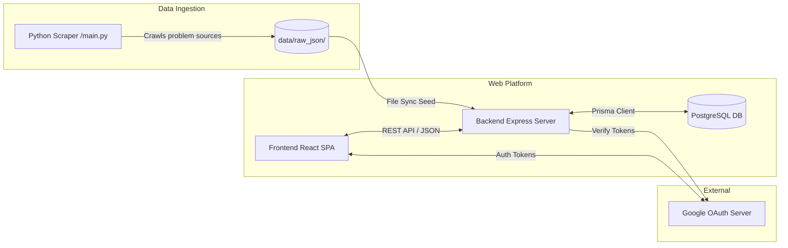
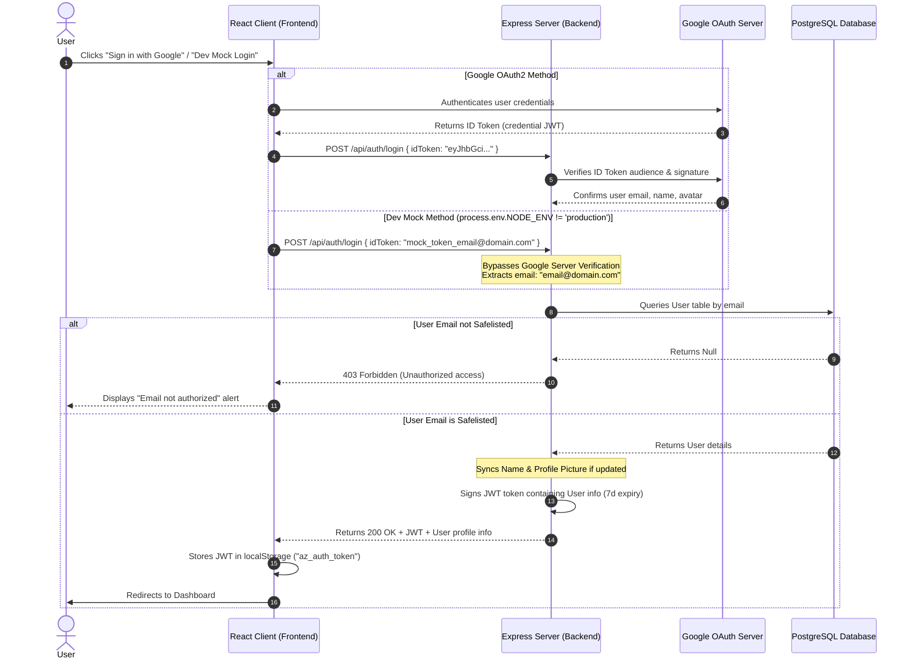
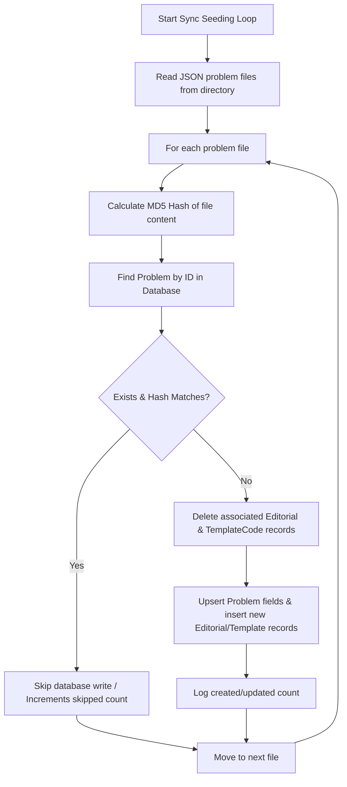

# System Architecture Guide

This document describes the high-level structural design, data flows, authentication mechanics, and seeding pipelines of the **ShahLMS** platform.

---

## 🏛️ System Overview

The platform uses a classic decoupled client-server architecture combined with an offline scraping pipeline:

---

## 🎨 Frontend Architecture

The frontend is a single-page React 19 application built with Vite and TailwindCSS:

* **Routing (`App.tsx`)**: Built on `react-router-dom` (v7) using a custom `<ProtectedRoute>` wrapper that gates route rendering based on the presence of a JWT token in the user's `localStorage` (`az_auth_token`).
* **API Layer (`src/lib/api.ts`)**: Employs a unified fetch wrapper (`ApiClient`) that automatically intercepts requests to attach the `Authorization: Bearer <token>` header, handles token expiry events (redirecting status 401 users back to `/login`), and parses standardized JSON response payloads.
* **Component System**:
  * **Layouts**: Gated pages are wrapped in a shared `<Layout>` (or `<Layout fullWidth={true}>` for the coding arena) containing sidebars and headers.
  * **LaTeX / Math Rendering**: Powered by `<MathRenderer>` using `katex` and `remark-math` to parse mathematical LaTeX notations embedded in scraped problem details.
  * **Code Editor**: Employs Microsoft's Monaco Editor (`@monaco-editor/react`) for writing solutions, supporting boilerplate code template injections and line-wrapping configurations.

---

## ⚙️ Backend Architecture

The backend is built as a modular Express server written in TypeScript:

* **Entrypoint (`src/index.ts`)**: Starts the Express server, configures CORS settings, sets up URL-encoded and JSON body parsers, registers request loggers (`morgan`), and connects routes to feature routers.
* **Feature Directories (`src/features/*`)**:
  Separated into discrete modules: `auth`, `problems`, and `admin`. Each module is structured into three layers:
  1. `*.routes.ts` - Defines Express routes and links them to middleware guards.
  2. `*.controller.ts` - Parses HTTP request params/bodies, controls status codes, and redirects results to services.
  3. `*.service.ts` - Encapsulates core database transactions, algorithmic computations, and data transformations.
* **Middlewares (`src/middlewares/*`)**:
  * `authMiddleware`: Decodes the incoming Bearer JWT token against the configured secret key. If valid, attaches the decoded payload (user ID, email, admin flag) to the request object.
  * `adminMiddleware`: Restricts route execution to authenticated requests where the attached user has `isAdmin: true`.
  * `errorHandler`: Captures uncaught route exceptions and converts them into standardized error payloads (status 500 or specific exceptions).

---

## 🔐 Authentication & Session Flow

The platform uses JWT-based sessions. Authentication supports both production-ready Google OAuth2 and a bypass mock-token system for development.

### Auth Sequence Diagram

---

## 🔄 Seeding & Synchronizing Pipeline

The core mechanism for updating problems catalog data combines Python scraper outputs with a Prisma seed utility.

### Change Tracking with Hashing
To prevent redundant database write overhead, the sync system compares the MD5 content hashes of scraped problem JSON files against hashes stored in the database:

* **Sync Triggers**:
  1. **CLI Mode**: Running `npm run db:seed` triggers `ts-node prisma/seed.ts`, syncing files directly from `data/raw_json/`.
  2. **Admin Portal UI**: Inside the frontend admin panel, administrators can click a seeding sync button which sends a POST request with the JSON array to `/api/admin/seed`. The Express server processes the data in the background, updating an in-memory seed status state that the client polls at `/api/admin/seed/status`.

---

## 🧪 Future Integration: Sandboxed Code Execution

Currently, the code execution feature inside the Coding Sandbox (`ProblemDetail.tsx`) utilizes a frontend simulation block:
* Clicking **Run on Sample** triggers a series of simulated states ("Compiling...", "Running Test Case 1...") using local `setTimeout` functions and mirrors the input text as stdout.
* Clicking **Submit** simulates a successful evaluation of 15/15 cases.

### Real Integration Blueprint
For full integration, the backend sandbox service will be extended to:
1. Connect to an isolated code sandbox execution service (e.g., **Judge0** api, AWS Lambda, or local Docker executor engines).
2. Take user code, selected programming language, and the target problem's sample/hidden inputs.
3. Securely compile, execute, and verify the outputs against the problem's expected output constraints.
4. Record and store the outcome under a `Submission` model mapped to the user and the problem.
