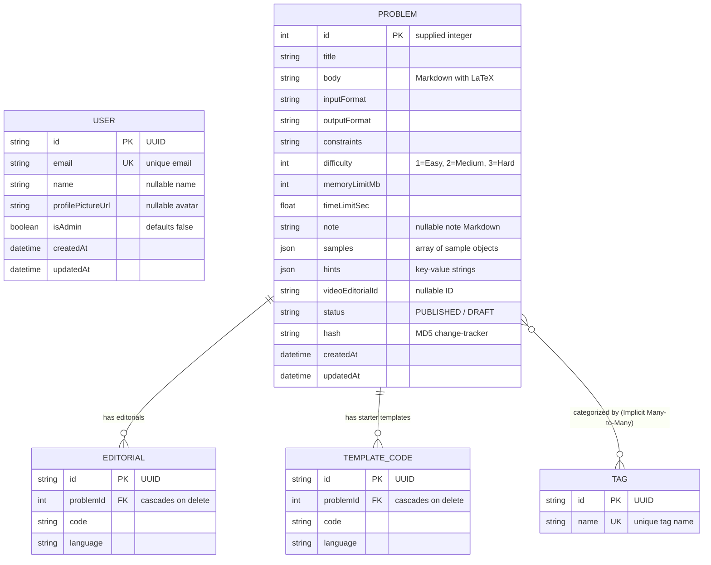

# Database Schema Design

This document details the PostgreSQL schema managed by the **Prisma ORM** inside the `platform/backend` component.

---

## 🗄️ Database Context
* **Database Provider**: PostgreSQL.
* **ORM Engine**: Prisma Client (`@prisma/client`).
* **Connection Config**: Configured through `DATABASE_URL` inside `platform/backend/.env`.

---

## 🗺️ Entity Relationship Diagram

The relationships between users, problems, categorization tags, starter code templates, and editorial walkthroughs are structured as follows:



---

## 📝 Model Definitions

### 1. `User` Model
Represents safelisted accounts that can authenticate.
* **Fields**:
  * `id`: `String` (UUID primary key).
  * `email`: `String` (Unique safelisted email address).
  * `name`: `String?` (Full name, synced on Google OAuth login).
  * `profilePictureUrl`: `String?` (Avatar link, synced on Google OAuth login).
  * `isAdmin`: `Boolean` (Enables access to `/admin/*` endpoints, defaults to `false`).
  * `createdAt` / `updatedAt`: Automatic timestamps.

### 2. `Problem` Model
Represents a DSA challenge.
* **Fields**:
  * `id`: `Int` (Explicit ID parameter, matches scraped problem indices).
  * `title`: `String` (Display title).
  * `body`: `String` (Description, supports math formula blocks using KaTeX).
  * `inputFormat` / `outputFormat` / `constraints`: `String` (Rules detailing inputs and execution boundaries).
  * `difficulty`: `Int` (Difficulty scale: 1 = Easy, 2 = Medium, 3 = Hard).
  * `memoryLimitMb`: `Int` (Maximum RAM allowed for solution runtime).
  * `timeLimitSec`: `Float` (Execution duration timeout limits).
  * `note`: `String?` (Optional comments or observations).
  * `samples`: `Json` (Array containing structure of test cases; see JSON schema below).
  * `hints`: `Json` (Key-value mapping of hints; see JSON schema below).
  * `videoEditorialId`: `String?` (Optional video walkthrough reference ID).
  * `status`: `String` (Publishing state, e.g., `"PUBLISHED"`).
  * `hash`: `String?` (MD5 hex hash computed from scraped source file content).

### 3. `Tag` Model
Defines problem categorization taxonomy terms.
* **Fields**:
  * `id`: `String` (UUID primary key).
  * `name`: `String` (Unique, e.g. `"Dynamic Programming"`).
* **Relations**:
  * implicitly linked to `Problem[]` via an automatically managed join table (`_ProblemTags`).

### 4. `Editorial` Model
Holds solution codes for completed problems.
* **Fields**:
  * `id`: `String` (UUID primary key).
  * `problemId`: `Int` (Foreign key mapping to the host Problem).
  * `code`: `String` (Solution source code block).
  * `language`: `String` (Target programming language, e.g., `"cpp"`, `"python"`, `"java"`).
* **Constraints**:
  * `onDelete: Cascade` ensures editorials are wiped when their parent problem is deleted.

### 5. `TemplateCode` Model
Stores starter boilerplates injected into the Monaco editor when a language is selected.
* **Fields**:
  * `id`: `String` (UUID primary key).
  * `problemId`: `Int` (Foreign key mapping to the host Problem).
  * `code`: `String` (Boilerplate structure).
  * `language`: `String` (Programming language).
* **Constraints**:
  * `onDelete: Cascade` ensures templates are wiped when their parent problem is deleted.

---

## 🗃️ Structured JSON Columns Schema

### 1. `Problem.samples` Column
Mapped as a PostgreSQL JSON column. It expects an array of objects matching the following layout:
```json
[
  {
    "input": "5\n1 2 3 4 5",
    "output": "15",
    "explanation": "Sum of values from 1 to 5 is 15."
  }
]
```

### 2. `Problem.hints` Column
Stores sequential guidance lists and solutions strategies:
```json
{
  "hint1": "Try to solve using two-pointer traversal.",
  "hint2": "Sort the array before comparing left and right pointers.",
  "solution_approach": "Sort the array in O(N log N). Keep pointers at index 0 and N-1. Shrink bounds..."
}
```

---

## ⚠️ Relational Cascading Rules
When seeding updates or modifying catalogs, standard SQL constraints apply:
1. When a problem's JSON hash changes, the seeding script clears existing child dependencies before reloading new records to prevent database constraint duplicates.
2. In Prisma, this is represented by:
   ```prisma
   model Editorial {
     problemId Int
     problem   Problem  @relation(fields: [problemId], references: [id], onDelete: Cascade)
   }
   ```
3. Therefore, executing a database deletion command like `prisma.problem.delete({ where: { id: 121 } })` instantly sweeps all associated templates and editorials out of the database without raising key constraints.
